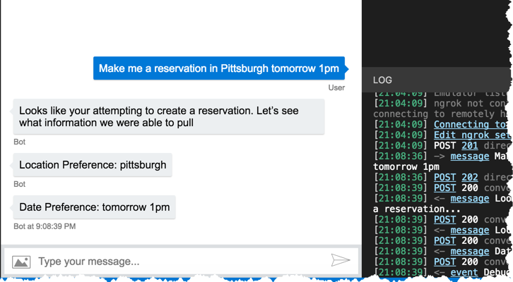

# Lab 3 - Integrate LUIS & State Management

Congratulations on making it this far! At this point you should have setup your .NET Bot Framework development environment [Lab 1](../1-setup) and have created, trained, and published your LUIS application [Lab 2](../2-luis).  Moving forward, we're going to be spending most of our time in Visual studio Code, so hopefully you're ready to get your hands dirty with some coding!

## Starter 

This lab includes the starter project, which is similar the project we completed in [Lab 1](../1-setup).

New files:

* [Reservation.ts](../3-integrate-luis/start/model/reservation.ts) - It contains a Reservation.ts class file which contains some properties which define a reservation.
* [constants.ts](../3-integrate-luis/start/constants.ts) - It contains, the intents and entity keys required to create the reservation bot.

## Get LUIS Model ID & Subscription Key.

Get the LUIS Model ID and subscription key from [LUIS website](https://luis.ai).


```
https://westus.api.cognitive.microsoft.com/luis/v2.0/apps/<MODEL_ID>?subscription-key=<SUBSCRIPTION_KEY> &verbose=true&timezoneOffset=0&q=
```

Without subscription key, you'll receive a 401-Unauthorized response when calling the REST API.

## Integrate LUIS recognizer to bot

Add the LUIS integration into your bot in app.ts. Add the *LuisAppId* and *LuisAPIKey* you retrieved from your LUIS model values in *.env* file. These values will be loaded into your process environment variables, when `require('dotenv').config()` calls.

``` typescript
// Add LUIS
const luisAppId = process.env.LuisAppId;
const luisAPIKey = process.env.LuisAPIKey;
const luisAPIHostName = process.env.LuisAPIHostName || 'westus.api.cognitive.microsoft.com';

const LuisModelUrl = 'https://' + luisAPIHostName + '/luis/v2.0/apps/' + luisAppId + '?subscription-key=' + luisAPIKey;

// Create a recognizer that gets intents from LUIS, and add it to the bot
const recognizer = new LuisRecognizer(LuisModelUrl);
bot.recognizer(recognizer);
```

### None Intent (Default Handler)

This default message handler is invoked if the user's utterance doesn't match any intents handled by other dialogs
The bot has a default message handler. Edit it to match the following:

```typescript
const bot = new UniversalBot(connector, (session, _args) => {
    // None or default handler
    session.endDialog('Sorry, I don\'t understand.  I only know how to make restaurant reservations.');
});
```

### Add Intent to handle **CreateReservation** intent we created in LUIS.

Add the dialog to the bot with triggerAction that matches `CreateReservation` intent.

```typescript
import { CreateReservationDialog } from "./dialogs/create-reservation-dialog";

bot.dialog('CreateReservationDialog',(session, args, next) => {
    // Create reservation
    session.endDialog('Looks like your attempting to create a reservation.');
})
.triggerAction({ matches: CONSTANTS.intents.CREATE_RESERVATION });
```

At this point, let's run our bot and see how smart it is. Go ahead and place breakpoints in the default handler and CreateReservation dialog waterfall steps and run Visual Studio Code in Debug mode.


Fire up the bot emulator and type in a message similar to the following:

> **Make me a reservation in Pittsburgh tomorrow at 7:30 pm**

Hopefully the CreateReservation dialog breakpoint hit! Take a moment to inspect the LuisResult that was passed to the method. You should hopefully see the `RestaurantReservation.Address` and the `builtin.datetimeV2.datetime` entities and their parsed values.

>If you don't get the expected results, it might mean that your app needs to be further trained and re-published, or perhaps your app wasn't previously published.

Assuming the last test was successful, let's type another message into the Bot Emulator. Something that has nothing to do with restaurant reservations, such as:

What's the weather like in Pittsburgh

What happened? Hopefully your default message handler method was hit!

### Moving dialog to dialogs directory.

Let's not bloat the app.ts. We will move the dialogs to its own directory. Create `create-reservation-dialog.ts` in dialogs directory and export as `CreateReservationDialog`. Import the `CreateReservationDialog` in app.ts and use it.

```typescript
import { CreateReservationDialog } from "./dialogs/create-reservation-dialog";

bot.dialog('CreateReservationDialog', CreateReservationDialog)
    .triggerAction({ matches: CONSTANTS.intents.CREATE_RESERVATION });
```

```typescript
const dialog = new WaterfallDialog([
    (session, args, next) => {
        session.endDialog('Looks like your attempting to create a reservation.');
    }
]);

export { dialog as CreateReservationDialog }

```

## State Management

As your bot becomes more complicated, you'll likely need to save state as you move from Dialog to Dialog throughout a conversation. In this example, we're going to retrieve the entities from luis recognizer intent object and store them in state.

Let's start by retrieving the LUIS entities from the given LuisResult. Update the CreateReservation dialog steps as follows:

## Retrieve entity from the intent result

Let's retrieve the entitiy from the results from LUIS using EntityRecognizer.

Initialize Private Conversation Data:

```typescript
// Initiate private Conversation data
    const reservation: Reservation = session.privateConversationData.reservation || new Reservation();
    session.privateConversationData.reservation = reservation;
```

Find Entity from the entities using key:

```typescript
    const entities: IEntity[] = args.intent.entities;
    const location = EntityRecognizer.findEntity(entities, CONSTANTS.entity.locationKey); 
    if(location) {
        reservation.location= location.entity;
    }
```

There are 3 types of state that you can store:

* **User State** - State tied to the user outside of any specific conversation (NOT cleared when a conversation ends)

* **Conversation State** - State tied to a conversation (which could include group conversations)

* **Private Conversation State** - State tied to the current user within a given conversation

For the sake of these lab, we are using the built-in memory state provider, however, for production bots you would want to persist state to a more durable storage. To learn more about storing state in Azure Cosmos DB or Azure Table Storage, please refer to the [Managing State](https://docs.microsoft.com/en-us/azure/bot-service/nodejs/bot-builder-nodejs-state?view=azure-bot-service-3.0) documentation provided by Microsoft.


Let's continue to build out our CreateReservation dialog. Here's the final result:

```js
const dialog = new WaterfallDialog([
    (session, args, next) => {
        const reservation: Reservation = session.privateConversationData.reservation || new Reservation();
        session.privateConversationData.reservation = reservation;

        const entities: IEntity[] = args.intent.entities;

        const location = EntityRecognizer.findEntity(entities, CONSTANTS.entity.locationKey); 
        if(location) {
            reservation.location= location.entity;
        }

        const cuisine = EntityRecognizer.findEntity(entities, CONSTANTS.entity.cuisineKey);
        if(cuisine) {
            reservation.cuisine = cuisine.entity;
        }

        const when = EntityRecognizer.findEntity(entities, CONSTANTS.entity.datetimeKey);
        if(when) {
            reservation.when = when.entity;
        }

        const partySize = EntityRecognizer.findEntity(entities, CONSTANTS.entity.partySizeKey);
        if(partySize) {
            reservation.partySize = partySize.entity;
        }
        
        session.send('Looks like your attempting to create a reservation.  Let\'s see what information we were able to pull');

        if(next) next();
    }, (session, _args, _next) => {
        const reservation: Reservation = session.privateConversationData.reservation;
        if(reservation != null) {
            if (reservation.location) {
                session.send(`Location Preference: ${reservation.location}`);
            }

            if (reservation.cuisine) {
                session.send(`Cuisine Preference: ${reservation.cuisine}`);
            }

            if (reservation.when) {
                session.send(`Date Preference: ${reservation.when}`);
            }

            if (reservation.partySize) {
                session.send(`Party Size Preference: ${reservation.partySize}`);
            }
        }

        session.endDialog();
    }
]);

export { dialog as CreateReservationDialog }
```

### Demo

Let's run the application again and type the following into the Bot Emulator (note, at this point you can remove your breakpoints):

**Make me a reservation in Pittsburgh tomorrow 1pm**

You should see a response similar to the following in your emulator.



Let's send another message. This time only send the location in the request:

**Make me a reservation in Tampa**


Wait a second, I only provided the city this time. Why did it also return the date from the previous request? If you remember, we replied with any values that we stored in state. This state persists throughout the conversation, therefore the state still contained the date from the previous request. I wonder what happens if you end the conversation? Let's go back to CreateReservation dialog and make a small change.

Let's replace this:

```
session.endDialog();
```
With this:

```
session.endConversation();
```

Go ahead an run the bot and the Bot Emulator. Within the emulator, type the following message:

**Make me a reservation in Pittsburgh tomorrow 1pm**

The bot should respond with the entered city and date. Now go ahead and type the following:

**Make me a reservation in Tampa**

This time we should notice that the date is NOT returned. This is because you didn't provide a date for the reservation and the previous state was wiped clean when you ended the conversation.

> Note, based on your LUIS app training, your partySize and time might give unpredictable results. If you see its recognized in both party size and when, your LUIS need more utterances or training data.

## Quick Recap

In this lab, we successfully connected our bot to our LUIS application, and configured our Create Reservation triggerAction. We also learned how to retrieve value from entities. Finally, we learned how to persist and retrieve state for our bot application.

## Next Steps

At this point in the labs we were able to configure our RootDialog to handle multiple user intents, but we're yet to do anything useful with the provided information. In subsequent labs, we'll create a more sophisticated conversational flow with multiple dialogs. However, before doing so I thought it would be a good idea to become familiar with some basic NodeJS Bot Builder concepts. In [Lab 4](../4-bot-builder) we'll focus on learning these concepts before moving back to enhance our bot!
