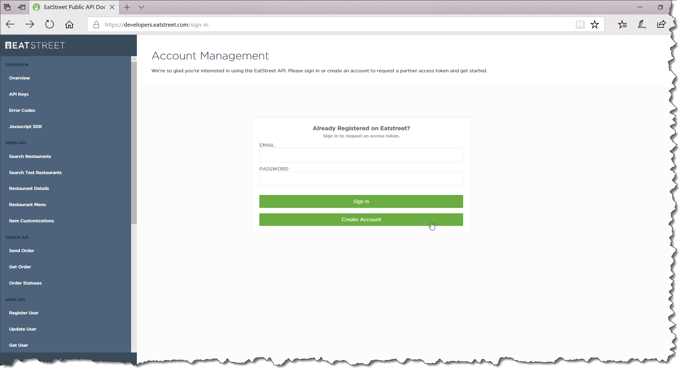
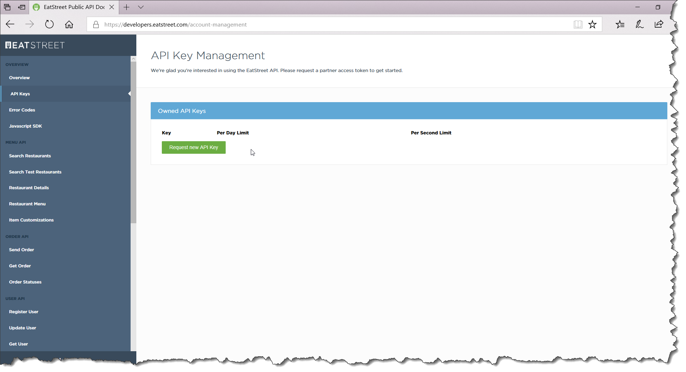
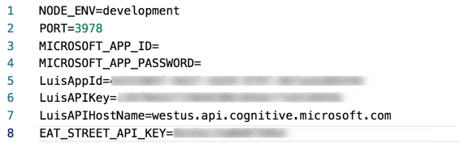

# Lab 5 - Dialogs

Glad you made it here. This is where our bot starts to get interesting! We're now going to update our bot to walk a user through the entire reservation process. The goal of will be to provide restaurant recommendations based on the user's location and preferred cuisine and help them make a reservation on a given date and for a specified number of people.

At this point, we've trained our LUIS model to allow users to provide most of this information through requests such as I'd like to reserve a table in Pittsburgh at a good Italian restaurant tomorrow at 8:30 pm for six people, but we still need to prompt them to select a restaurant. Additionally, what if the user only provides some of the information required to make a reservation, such as Make me a reservation in Pittsburgh or I'd like a table at 8:30 tomorrow night. In these cases, we still need to collect additional information to complete the request.

In this lab, we are going to create a Dialog for each piece of information we need to collect and prompt the user when additional information is required. Below is a list of the Dialogs we'll be creating:

* ConfirmReservationDialog
* LocationDialog
* CuisineDialog
* RestaurantDialog
* WhenDialog
* PartySizeDialog

## Start project

Once again, you'll need to use the starter solution in this lab has as it contains a number of files that you'll need get your code running. Below is a brief explanation of the new files you'll find in the starter project (take a moment to review them):

### Locale

Contains static strings for bot responses. Doing so makes the code more maintainable and sets us up to support multilingual scenarios in the future.

### service/restaurant-services.ts

Houses the logic for querying and returning restaurants based on location and cuisine. This class makes use of the publicly available EatStreet REST API.

### Models

This directory contains Cuisine, Reservation, Restaurant, and RestaurantSearchResults classes. These classes house the data we retrieve from the RestaurantService

## Prerequisites
There's a quick prerequisite we need to take care of before getting started.  Go ahead an open the *start* directory with Visual Studio code and complete the following steps:

#### Eat Street API Key
The code in the *RestaurantServices* uses the publicly available  [EatStreet REST API](https://www.programmableweb.com/api/eatstreet) to query for restaurants.  Why did I chose this API?  Because it's free and getting access is a breeze.  That being said, you do have to register for an account to receive an access key.  Here are the steps:

1.	Navigate to the [Eat Street sign-in page](https://developers.eatstreet.com/sign-in) and create a new account
	
	

2.	Once registered, you should immediately be taken to a page which allows you to generate an access key.  Click *Request new API Key* and copy the provided key

	

3.	Open the *.env* and copy the key to the *EAT_STREET_API_KEY* value 

	

## Reservation Conversation Logic
Alright, we're ready to get going!  Below you'll find a high-level blueprint of the reservation conversational flow your going to be creating.  Hopefully you'll notice a pattern forming. 


* **CreateReservationDialog**
    * Gather the state provided by the user's initial request and *Call* the *LocationDialog* and start other dialogs in waterfall steps. Once the reservation is confirmed, end the conversation

* **LocationDialog**     
    * *Start*
        * IF the location was NOT retrieved from the original request, ask the user for their preferred location and *Wait* for their response
        * OTHERWISE, `endDialog` with result.
    * *Handler*
        * IF the user-provided location is valid, save to state and `endDialog` with result.
        * OTHERWISE, notify the user that the location was not found, reprompt/restart location dialog

* **CuisineDialog**     
    * *Start*
        * IF the cuisine was NOT retrieved from the original request, ask the user for their preferred cuisine and *Wait* for their response.
        * Add `retryPrompt` parameter to reprompt, if the user entered option is invalid.
        * OTHERWISE, `endDialog` with result.
    * *Handler*
        * IF the user-provided cuisine is valid, save to state and `endDialog` with result.

* **RestaurantDialog**     
    * *Start*
        * Ask the user for their preferred restaurant and *Wait* for their response
        * Add `retryPrompt` parameter to reprompt, if the user entered option is invalid.
    * *Handler*
        * IF the user-provided restaurant is valid, save to state and `endDialog` with result.

* **WhenDialog**     
    * *Start*
        * IF the reservation date / time was NOT retrieved from the original request, ask the user for their preferred time and *Wait* for their response
        * OTHERWISE, `endDialog` with result.
    * *Handler*
        * IF the user-provided date / time is valid, save to state and `endDialog` with result.        

* **PartySizeDialog**     
    * *Start*
        * IF the party size was NOT retrieved from the original request, ask the user for their preferred number of people and *Wait* for their response
        * OTHERWISE, `endDialog` with result.
    * *Handler*
        * IF the user-provided party size is valid, save to state nd `endDialog` with result.     
* **ConfirmReservationDialog**     
    * *Start*
        * Ask the user to confirm the reservation and *Wait* for their response
    * *Handler*
        * IF the user-provided a valid confirmation, save to state and `endDialog` with result.            

## Dialogs

Let's update our code to match this logic.

### Create Reservation Dialog

Update the create reservation dialog. The create reservation dialog implements the waterfall steps and start dialogs in steps to control the conversation flow.

```typescript
const dialog = new WaterfallDialog([
    (session, args, _next) => {
        const reservation: Reservation = session.privateConversationData.reservation || new Reservation();
        session.privateConversationData.reservation = reservation;

        // let intent: IIntent = args.intent.intent;
        const entities: IEntity[] = args.intent.entities;

        reservation.location = findLocation(entities);
        reservation.cuisine = findCuisine(entities);
        reservation.when = findWhen(entities);
        reservation.partySize = findPartySize(entities);

        session.send('GREETINGS');
        session.beginDialog('LocationDialog');
    },
    (session, _results, _next) => {
        session.beginDialog('CuisineDialog');
    },
    (session, _results, _next) => {
        session.beginDialog('RestaurantDialog');
    },
    (session, _results, _next) => {
        session.beginDialog('WhenDialog');
    },
    (session, _results, _next) => {
        session.beginDialog('PartySizeDialog');
    },
    (session, _results, _next) => {
        session.beginDialog('ConfirmReservationDialog');
    },
    (session, _results, _next) => {
        const reservation: Reservation = session.privateConversationData.reservation;
        // Ask confirmation
        session.send('BOOKED_CONFIRMATION', reservation.restaurant!.name, moment(reservation.when).format('ll'), moment(reservation.when).format('LT'));
        session.endConversation();
    }
]);
```

### Location Dialog

Create `location-dialog.ts` in dialogs directory.  

In this location dialog, 

    * Check whether reservation location is available
    * If there is reservation location, end this dialog with result
    * Otherwise, prompts the user
    * Once user enters the response, check whether any restaurants are available in the location.
    * If the restaurants are available in location, save the location in state data.
    * Otherwise, call replaceDialog (or restart the location dialog) with args `{unrecognized: true}`
    * If `unrecognized` flag is present in args, change the prompt text with unrecognized message.

> We are replacing the location dialog because the prompt is text. The text prompt recognizer will accept any text as plain text. In case of other dialog prompts, we are passing `retryPrompt`. If prompt is not recognized valid user response, the prompt will do reprompt again with different message. Take a look at other dialogs. You will see the difference.

```typescript
import { Prompts, WaterfallDialog } from "botbuilder";
import { Reservation } from "../model/reservation";
import { RestaurantService } from "../service/restaurant-service";

const dialog = new WaterfallDialog([
    (session, args, _next) => {
        const reservation: Reservation = session.privateConversationData.reservation;
        if (reservation.location) { 
            session.endDialogWithResult({response: reservation.location});
            return;
        }

        // If location dialog args is unrecognized, change the message.
        if(args && args.unrecognized) {
            Prompts.text(session, 'LOCATION_UNRECOGNIZED');
        } else {                    
            Prompts.text(session, 'LOCATION_REQUEST');
        }
    },
    async (session, results, _next) => {
        // Get location
        const location = results.response;
        const reservation: Reservation = session.privateConversationData.reservation;
            
        if (await RestaurantService.hasRestaurants(location)) {
            reservation.location = location;
            session.send('LOCATION_CONFIRMATION', location);
            session.endDialogWithResult({ response: location });
        } else {
            session.replaceDialog('LocationDialog', { unrecognized: true });
        }        
    }
]);

export { dialog as LocationDialog }
```

### Cuisine Dialog

Create `cuisine-dialog.ts` in dialogs directory.  

In this cuisine dialog, 

    * Check whether reservation cuisine is available
    * If there is reservation cuisine, end this dialog with result
    * Otherwise, prompts the user with cuisine available in the location and with retryPrompt (with unrecognized cuisine value as text)
    * Once user enters the response, check whether any restaurants are available in the location and cuisine.
    * If the restaurants are available in location, save the cuisine in state data.

```typescript
import { CardAction, Message, Prompts, SuggestedActions, WaterfallDialog } from "botbuilder";
import * as _ from "lodash";
import { Reservation } from "../model/reservation";
import { RestaurantService } from "../service/restaurant-service";

const dialog = new WaterfallDialog([
    async (session, args, next) => {
        const reservation: Reservation = session.privateConversationData.reservation;
        if (reservation.cuisine) {  
            session.endDialogWithResult({ response: reservation.cuisine });
            return; 
        }
    
        // Ask cuisines
        const cuisines = await RestaurantService.getCuisines(reservation.location!);
        const cardActions = _.map(cuisines, (x) => {
            return CardAction.imBack(session, x.name, `${x.name} (${x.count})`);
        });

        const choices = _.map(cuisines, (x) => x.name);
        const suggestedActions = SuggestedActions.create(session, cardActions);

        const msg = new Message(session)
            .text('CUISINE_REQUEST')
            .suggestedActions(suggestedActions);
    
        const retryPrompt = new Message(session)
             .text('CUISINE_UNRECOGNIZED')
             .suggestedActions(suggestedActions);

        Prompts.choice(session, msg, choices, { retryPrompt });
    },
    async (session, results, _next) => {
        // Get cuisine
        const cuisine = results.response;
        const reservation: Reservation = session.privateConversationData.reservation;

        if (RestaurantService.hasRestaurantsWithCuisine(reservation.location!, cuisine)) {
            reservation.cuisine = cuisine.entity;
            session.send('CUISINE_CONFIRMATION');
            session.endDialogWithResult({ response: cuisine });                    
        }                     
    }
]);

export { dialog as CuisineDialog }
```

### Restaurant Dialog

Create `restaurant-dialog.ts` in dialogs directory.

In this restaurant dialog, 

    * Check whether reservation's restaurant is available
    * If there is reservation's restaurant, end this dialog with result
    * Otherwise, prompts the user with restaurants available in the location and cuisine with retryPrompt (with unrecognized restaurant message as text)
    * Once user enters the response, get the restaurant from restaurant service.
    * Save the restaurant details in state data and `endDialog` with result.

```typescript
import { AttachmentLayout, CardAction, CardImage, Message, Prompts, ThumbnailCard, WaterfallDialog } from "botbuilder";
import * as _ from "lodash";
import { Reservation } from "../model/reservation";
import { RestaurantService } from "../service/restaurant-service";

const dialog = new WaterfallDialog([
    async (session, _args, _next) => {
        const reservation: Reservation = session.privateConversationData.reservation;
        if(reservation.restaurant) {
            session.endDialogWithResult({ response: reservation.restaurant });
        }

        // Ask restaurants to select
        const restaurants = await RestaurantService.getRestaurants(reservation.location!, reservation.cuisine!);
        const cardAttachments = _.map(restaurants, (restaurant) => {
            const card = new ThumbnailCard(session)
                .title(restaurant.name)
                .subtitle(restaurant.address)
                .images([CardImage.create(session, restaurant.logoUrl.toString())])
                .buttons([
                    CardAction.openUrl(session, restaurant.url.toString(), 'More Info'),
                    CardAction.imBack(session, restaurant.name, 'Select')
                ])
            return card.toAttachment();
        });

        const choices = _.map(restaurants, (x) => x.name);

        const msg = new Message(session)
            .text('RESTAURANT_REQUEST', reservation.cuisine, reservation.location)
            .attachments(cardAttachments)
            .attachmentLayout(AttachmentLayout.carousel);

        const retryPrompt = new Message(session)
             .text('RESTAURANT_UNRECOGNIZED')
             .attachments(cardAttachments)
             .attachmentLayout(AttachmentLayout.carousel);

        Prompts.choice(session, msg, choices, { retryPrompt });
    },
    async (session, results, _next) => {
        // Get restaurant
        const restaurantName = results.response.entity;
        const reservation: Reservation = session.privateConversationData.reservation;

        const restaurant = await RestaurantService.getRestaurant(reservation.location!, restaurantName);

        if (restaurant) {
            reservation.restaurant = restaurant;
            session.send('RESTAURANT_CONFIRMATION', restaurant.name);
            session.endDialogWithResult({ response: restaurant });
        }     
    }
]);

export { dialog as RestaurantDialog }
```

### When Dialog

Create `whend-dialog.ts` in dialogs directory.

In this when dialog, 

    * Check whether reservation's when is available
    * If there is reservation's when, end this dialog with result
    * Otherwise, prompts the user to enter the date and time.
    * Once user enters the response, save the `when` in state data and `endDialog` with result.

```typescript
import { EntityRecognizer, Prompts, WaterfallDialog } from "botbuilder";
import * as moment from "moment";
import { Reservation } from "../model/reservation";

const dialog = new WaterfallDialog([
    async (session, _args, next) => {
        const reservation: Reservation = session.privateConversationData.reservation;
        if (reservation.when) { 
            session.endDialogWithResult({ response: reservation.when });
            return; 
        }
        // Ask time
        Prompts.time(session, 'WHEN_REQUEST', { retryPrompt: 'WHEN_UNRECOGNIZED' });
    },
    async (session, results, _next) => {
        // Get time
        let whenTime : Date | null = null;
        if (results.response) {
            whenTime = EntityRecognizer.resolveTime([results.response]);

            const reservation: Reservation = session.privateConversationData.reservation;
            reservation.when = whenTime;

            session.send('WHEN_CONFIRMATION', reservation.restaurant!.name, moment(whenTime).format('LLLL'));            
            session.endDialogWithResult({ response: whenTime });
        }             
    }
]);

export { dialog as WhenDialog }
```
### Party Size Dialog

Create `party-size-dialog.ts` in dialogs directory.

In this partySize dialog, 

    * Check whether reservation's partySize is available
    * If there is reservation's partySize, end this dialog with result
    * Otherwise, prompts the user to enter the number.
    * Once user enters the response, save the `partySize` in state data and `endDialog` with result.

```typescript
import { Prompts, WaterfallDialog } from "botbuilder";
import { Reservation } from "../model/reservation";

const dialog = new WaterfallDialog([
    async (session, _args, next) => {
        const reservation: Reservation = session.privateConversationData.reservation;
        if (reservation.partySize) {
            session.endDialogWithResult({ response: reservation.partySize });
            return; 
        }

        // Ask party sizes
        Prompts.number(session, 'PARTY_REQUEST', { retryPrompt: 'PARTY_UNRECOGNIZED'});
    },
    async (session, results, _next) => {
        // Get party size
        const partySize = results.response;
        if (partySize) {
            const reservation: Reservation = session.privateConversationData.reservation;
            // tslint:disable-next-line:radix
            reservation.partySize = parseInt(partySize);

            session.send('CONFIRMATION');
            session.endDialogWithResult({ response: partySize });
        }
    }
]);

export { dialog as PartySizeDialog }
```

#### Confirm Reservation Dialog

Create `confirm-reservation-dialog.ts` in dialogs directory.

In this confirm-reservation dialog, we render a HeroCard, showing the selected restaurant name, reservation date, restaurant logo, etc, with button `Reserve`. Once user clicks the button `Reserve`, we are reserving the restaurant. (Don't worry, we are not making any actual reservations for this lab)

```typescript
import { CardAction, CardImage, HeroCard, Message, Prompts, WaterfallDialog } from "botbuilder";
import * as moment from "moment";
import { Reservation } from "../model/reservation";
import { Restaurant } from "../model/restaurant";

const dialog = new WaterfallDialog([
    async (session, _args, _next) => {
        // Ask confirmation
        const reservation: Reservation = session.privateConversationData.reservation;
        const when = moment(reservation.when);
        const restaurant = Restaurant.fromJson(reservation.restaurant);

        const card = new HeroCard(session)
            .title(`${restaurant.name} (${reservation.partySize})`)
            .subtitle(when.format('LLLL'))
            .text(`${restaurant.address}`)
            .images([CardImage.create(session, restaurant.logoUrl.toString())])
            .buttons([CardAction.imBack(session, 'Reserve', 'Reserve')]);

        const msg = new Message(session)
            .text('RESERVATION_CONFIRMATION')
            .attachments([card.toAttachment()]);

        const retryPrompt = new Message(session)
            .text('CONFIRMATION_UNRECOGNIZED')
            .attachments([card.toAttachment()]);

        Prompts.choice(session, msg, 'Reserve', { retryPrompt });
    },
    async (session, results, _next) => {
        if (results.response.entity === 'Reserve') {
            // Ask confirmation
            session.endDialogWithResult({ response: 'confirmed' });
        }
    }
]);

export { dialog as ConfirmReservationDialog }
```

### Demo

Let's run it!  Fire up the Bot Emulator and enter the following information:

1. First, ask your bot to `make me a reservation`
2. When it asked for a location, type `Pittsburgh`
3. Next, select a Cuisine from the provided suggestions
4. Then select a restaurant from the provided options
5. When asked for the date, type `tommorrow night at 7:30`
6. And when asked for the number of people, type `6`
7. Click *Reserve*

Your bot should also be smart enough to avoid asking for information the user provided during the initial request.  Let's try the following:

1. First, ask your bot to `make me a reservation in Pittsburgh for 6 people tomorrow night at 7:30`
2. When asked for cuisine, select from the provided suggestions
4. Next select a restaurant from the provided options
7. Click *Reserve*

Notice this time you should NOT have been asked to provide a date or number of people since you already provided that information in the initial request.

## Quick Recap
Congratulations!  At this point you should have a fairly nifty bot that walks user's through the entire reservation process.  In doing so, we implemented the following:

1. A **Dialog** chain to solicity reservation information from the user
2. Rich visualizations in the form of message **Attachments**

## Next Steps
While our bot is fairly functional, there's a glaring limitation.  What if the user wants to change information provided in a previous step.  At this point, our bot has no way of handling this.  But fear not, in the [Lab 6](6-luis-all-the-way-down), we're going to kick it up a notch and refactor our bot to support fluid conversations!