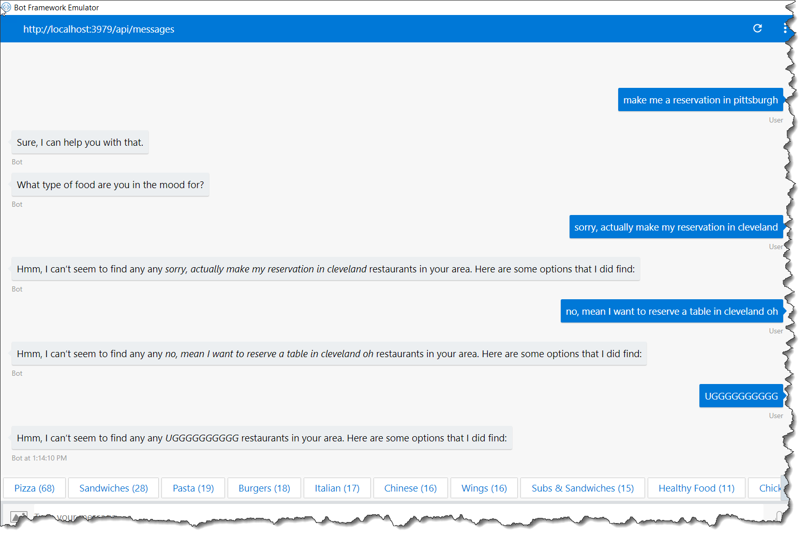
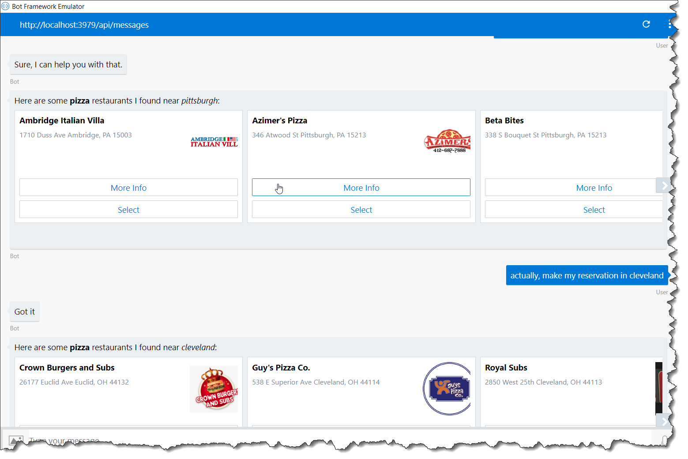
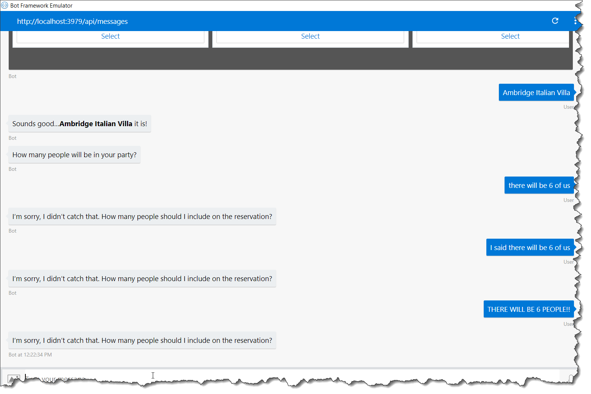
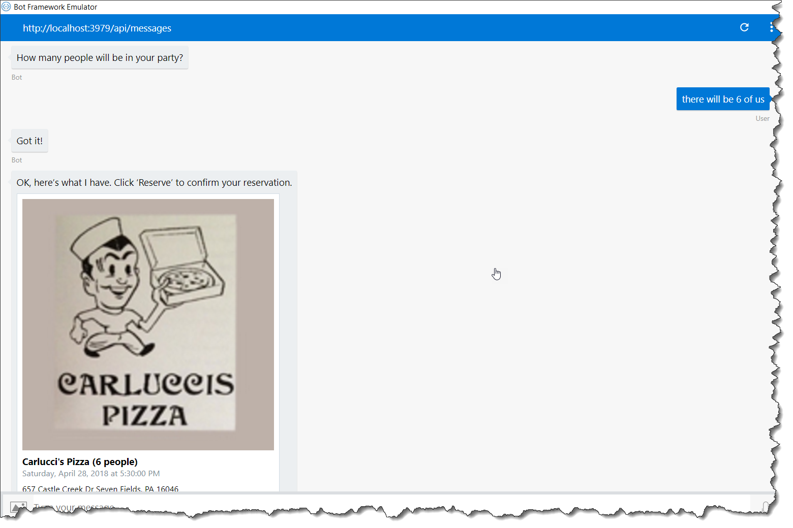
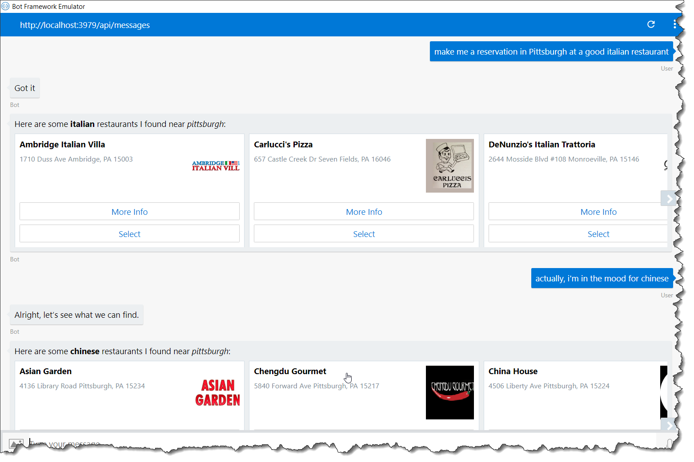

# Lab 6 - LUIS All the Way Down

Welcome to Lab 6! At this point, you should have a fully-functioning reservation bot! However, there are some limitations. The bot is very linear.

The user provides a location, preferred cuisine, restaurant, date / time, and party size in that order. But what if the user wants to go back and change a previous selection? 

> For example, if prior to confirming the reservation, what if the user wants to change the date and time? Or, what if the user requests thai food and wants to switch to Italian? 

In these situations, our bot provides a very frustrating user-experience, as their is no way to go back and change previous values. Go ahead and try it.

Run your bot and ask it to `make a reservation in Pittsburgh`. When it prompts you for your preferred cuisine, type `sorry, actually make my reservation in Cleveland`. We're stuck! Our bot has no idea what's going on!



Don't worry, we're going to fix that! Here's one the most important things to understand when designing your bot...**CONVERSATIONS ARE NOT LINEAR!** We often bounce around between different topics. Another thing...**USERS AREN'T ROBOTS!**

It's almost like we need some kind of natural language processing when dealing with user responses to our bot...but how?

Oh Yeah, LUIS!

In this lab, we're going to integrate LUIS not only in our *RootDialog*, but with every **Dialog** on the path to making a reservation!

> In this lab, we will be calling LUIS more frequently, which *may* cause you to see errors if the free LUIS tier starts throttles your requests (I believe the free tiers allows 5 calls / minute up to 10,000 calls / month).  If you want to move onto a paid tier of LUIS, you can perform the following step (you'll need to access your Azure subscription with the same account you used to login to LUIS): 
> 
> * Follow [these steps](https://docs.microsoft.com/en-us/azure/cognitive-services/cognitive-services-apis-create-account) to create a new *Cognitive Services Account* within your Azure Subscription.  Make sure you select the same *Region* as your LUIS app (mine is *West US*).  Also select *Standard* for the pricing tier.  Once provisioned, make note of the *Cognitive Service's Key* for the next step.
> * Register the *Cognitive Service Account's* access key with your LUIS application as described [here](https://docs.microsoft.com/en-us/azure/cognitive-services/luis/manage-keys).

## Implementation

### More LUIS intents

* Add more intents to trigger the create reservation dialog. The new intents such as `Set Reservation Cuisine`, `Set Reservation Date`, `Set Reservation Location`, `Set Reservation Party Size` in `app.ts`.

```typescript
bot.dialog('CreateReservation', CreateReservationDialog)
   .triggerAction({ matches: [
    CONSTANTS.intents.CREATE_RESERVATION, CONSTANTS.intents.SET_RESERVATION_CUISINE,
    CONSTANTS.intents.SET_RESERVATION_DATE, CONSTANTS.intents.SET_RESERVATION_LOCATION,
    CONSTANTS.intents.SET_RESERVATION_PARTY_SIZE
]});
```

* Handle the intent individually in `Create Reservation` dialog. If any specific intent triggers the dialog, parse the entity and store it in state data. Start the location dialog again to follow the conversation flow to complete reservation.

```typescript
(session, args, _next) => {
        const reservation: Reservation = session.privateConversationData.reservation || new Reservation();
        session.privateConversationData.reservation = reservation;

        const intent: IIntent = args.intent;
        const entities: IEntity[] = args.intent.entities;

        switch (intent.intent) {
            case CONSTANTS.intents.CREATE_RESERVATION:
                reservation.location = findLocation(entities);
                reservation.cuisine = findCuisine(entities);
                reservation.when = findWhen(entities);
                reservation.partySize = findPartySize(entities);
                session.send('GREETINGS');
                break;
            case CONSTANTS.intents.SET_RESERVATION_LOCATION:
                const location = findLocation(entities);
                if (location) {
                    reservation.location = location;
                    // Reset restaurant when location and cuisine changes
                    reservation.restaurant = undefined;
                    session.send('LOCATION_CONFIRMATION', reservation.location);
                }
                break;
            case CONSTANTS.intents.SET_RESERVATION_CUISINE:
                const cuisine = findCuisine(entities);
                if (cuisine) {
                    reservation.cuisine = cuisine;
                    // Reset restaurant when location and cuisine changes
                    reservation.restaurant = undefined;
                    session.send('CUISINE_CONFIRMATION', reservation.cuisine);
                }
                break;
            case CONSTANTS.intents.SET_RESERVATION_DATE:
                const when = findWhen(entities);
                if (when) {
                    reservation.when = when;
                    session.send('WHEN_CONFIRMATION', reservation.when);
                }
                break;
            case CONSTANTS.intents.SET_RESERVATION_PARTY_SIZE:
                const partySize = findPartySize(entities);
                if (partySize) {
                    reservation.partySize = partySize;
                    session.send('PARTY_SIZE_CONFIRMATION', reservation.partySize);
                }
                break;
        }
        // Start with location dialog again.
        session.beginDialog('LocationDialog');
});
```

* Hold on, there is one more change. Did you remember, we are prompting user for different responses such as choices, number, time, etc. That response too should recognize by LUIS recognizer, in case user responds out of context to the prompt.

> For eg, the cuisine dialog prompts user to select one cuisine from list. But user replies, `sorry i need to change the location to tampa`, the LUIS recognizer should understand this and trigger `CreateReservationDialog` with intent `Set Reservation Cuisine`

For that, let's customize prompts to add recognizer.

In `app.ts`, add below lines. In luis prompt handler, cancel the current dialog and start the `CreateReservationDialog` with params `{ intent: args}`. This `args` contains luis recognizer result intent and entities.

```typescript
const luisPromptHandler = (session:Session, args:any) => {
    session.cancelDialog(0);
    session.beginDialog('CreateReservation', { intent: args });
};

// Customize Prompts
Prompts.customize(PromptType.attachment, new PromptAttachment().recognizer(recognizer).matchesAny(dialogMatches, luisPromptHandler));
Prompts.customize(PromptType.choice, new PromptChoice().recognizer(recognizer).matchesAny(dialogMatches, luisPromptHandler));
Prompts.customize(PromptType.confirm, new PromptConfirm().recognizer(recognizer).matchesAny(dialogMatches, luisPromptHandler));
Prompts.customize(PromptType.number, new PromptNumber().recognizer(recognizer).matchesAny(dialogMatches, luisPromptHandler));
Prompts.customize(PromptType.text, new PromptText().recognizer(recognizer).matchesAny(dialogMatches, luisPromptHandler));
Prompts.customize(PromptType.time, new PromptTime().recognizer(recognizer).matchesAny(dialogMatches, luisPromptHandler));

```

## Demo

Alright, let's try this again. Run your project and ask your bot to `make a reservation at a pizza restaurant in Pittsburgh` (make sure you end the previous conversation in the Bot Emulator). When it prompts for your preferred cuisine, respond by saying sorry, `actually make my reservation in Cleveland.`



Alright, let's try something else. Go back to your emulator (make sure to end the previous conversation), and walk through creating a reservation, all the way up until the bot asks you for the number of people on the reservation. When it does, type if `there will be 6 of us`. Hmmm, maybe our bot isn't as smart as we thought.



However, unlike our previous example, our Create Reservation intent isn't (and shouldn't be) trained to handle such a statement, and we don't have any intents that have been trained to do so. 

Remember how our `CreateReservation` dialog referenced a number of intents that we've yet to create (more specifically, Set Reservation Location, Set Reservation Date, Set Reservation Cuisine, and Set Reservation Party Size)? Let's create them now!

#### Set Reservation Location Intent
Browse to your [LUIS App](https://www.luis.ai), and create a new **intent** called *Set Reservation Location*.

> If you need a refresher on creating, training, and publishing intents, refer back to [Lab 2](https://github.com/gtewksbury/Microsoft-Bot-Framework-HOL/tree/master/lab%202%20-%20LUIS).

Add some **utterances** representing someone wanting to change their location and map the *RestaurantReservation.Address* entities when required.  Here are some examples:

> actual, I'll be in Houston TX

> sorry, I'm actually near Boston

> could you look in Baltimore

> I forgot, I'm in Pittsburgh

> Forget that, I'll be in San Francisco

> actually, I forgot, I'll be in chicago

> actually, can you look in Los Angeles

> change my location to Cleveland

> sorry, i gave you the wrong location, let's look in Phoenix

> Update my location to Orlando FL

#### Set Reservation Date Intent
Create a new **intent** called *Set Reservation Date*.

Add some utterances representing someone wanting to change their reservation date and map the *datetimeV2* entities when required. Here are some examples:

> actually, let's do tomorrow night at 4:30

> change the date to Monday at 5:30 pm

> sorry, let's do 9:30 next Friday

> tomorrow at 3pm

> on second thought, I'd like to eat tonight at 7

> sorry, I gave you the wrong date, let's do Friday at 9:15 pm

> update my reservation to tomorrow at 4:30 pm

#### Set Reservation Cuisine Intent
Create a new **intent** called *Set Reservation Cuisine*.

Add some utterances representing someone wanting to change their preferred cuisine and map the *RestaurantReservation.Cuisine* entities when required. Here are some examples:

> actually, are there any good mexican options

> I'm in the mood for italian

> actually, thai sounds good

> On second thought, I could go for some chinese food

> A restaurant that serves Mediterranean would be nice

> Sorry, let's look for a restaurant that serves burgers

> you know what, I could go for sushi

> let's see if there are any restaurants that serve sandwiches

> nothing great there, how about middle eastern?


#### Set Reservation Party Size Intent
Create a new **intent** called *Set Reservation Party Size*.

Add some utterances representing someone wanting to change the number of people on a reservation and map the *number* entities when required. Here are some examples:

> actually, there will be three of us

> on second thought, there will be 10 of us

> sorry, can you update the reservation to six people

> actually, there will just be 2 of us

> we're expecting 6 people

> eight people

> actually, there are 7 of us

> sorry, we'll have 3 people

> update the reservation for 4 people

#### Train and Publish
Now go ahead and *train* and subsequently *publish* you changes (remember, you need to *publish* after training for you updated model to be exposed via the LUIS REST API).

Let's go back to our bot and try again.  Begin a new reservation request, and when the bot prompts you for the number of people, enter `there will be 6 of us`.




Success! The request should have been gracefully interpreted as a Set Reservation Party Size intent 

Let's try another example. Start a new conversation and type `Make me a reservation at a good italian restaurant in pittsburgh`. When the bot prompts you with restaurant recommendations, type `actually, I'm in the mood for chinese`. Hopefully your bot was able to handle this gracefully as well.



Hopefully this helps instill the importance of supporting fluid conversations when building your own bot experiences!

## Quick Recap

In this lab, we learned some relatively simple design patterns for integrating LUIS at all levels of a **conversation**, making our bots adaptive to fluid requests.  By doing so, we were able to drastically improve the user experience of our bot application.

## Next Steps
There may be times that you want to globally handle specific responses regardless of the user's current position in the **DialogStack** (such as the user typing *help* or *cancel*).  In [Lab 7](7-scorables) we'll introduce the concept of **Scorables** and global message handlers to do exactly that.