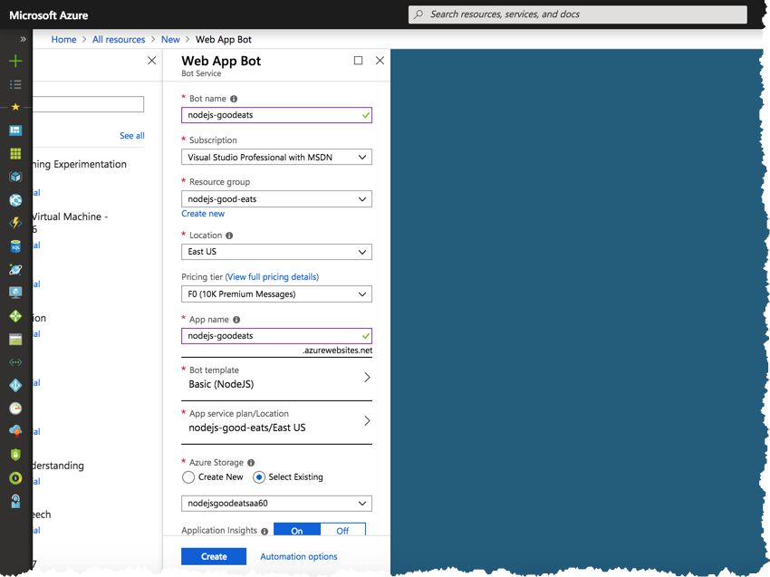

# Lab 8 - Azure Bot Services

Up until this point, we've been interacting with our bot through our local emulator, but how do you actually host your bot so it can be consumed by external **channels**?  In this lab, we'll learn how to deploy our bot application to an Azure Bot Service from Visual Studio Code.

## Create Azure Web App Bot

Log into the [Azure Portal](https://portal.azure.com), and click the *Create a resource* button on the top left of your screen.  On the following screen, select *AI + Cognitive Services* and click *Web App Bot*


Enter the required settings and click the *Create* button



* **Bot name** must be globally unique.  This will be included in the URL to your Bot API
* **Pricing Tier** *F0* is free of charge
* **Bot Template** should be *Basic (NodeJS)*

> The remaining settings are outside the scope of this tutorial, but the defaults should be fine for our purpose.

Once created, you can navigate to your new *Web App Bot* within Azure.  It should look something like this:


## Publish
The following section walks through publishing your bot through Visual Studio Code.

Install [Azure App Service extension](https://marketplace.visualstudio.com/items?itemName=ms-azuretools.vscode-azureappservice
) from Visual Studio Code, if you don't have yet.

> While Visual Studio Code deployments are fine for our purposes, it's highly recommended to publish production bots through automated CI / CD pipelines.
1. Add below snippet in your `.vscode/settings.json` to skip uploading local .env and .vscode files.

```json
  "appService.zipIgnorePattern": [
        ".env",
        ".vscode{,/**}",
        "*.md"
    ],
```

You've to add your .env keys/values to "AppSettings" of Azure Web Bot. You can add it in portal or through Azure App Service in Visual Studio Code.

2. Open you bot project in Visual Studio Code. Open command pallette in Visual Studio Code using `Cmd/Ctrl + Shift + p`. 

3. Search for `Azure App Services - Deploy to Web App`


4. Select subscription and the web app we created in this lab before. You may need to connect your subscription before, if you are doing for first time.


5. Visual Studio Code will immediately start deploying your application to Azure.

Congratulations!  You're bot should now be successfully hosted within a durable Azure App Services environment!

## Test Web Chat

Let's go back to our app in Azure and explore a bit.  You should notice a *Test in Web Chat* option in the side menu.  Go ahead and click it.

This is a test area for your deployed bot.  Go ahead and type a message to see if it's working!


By default, *Web App Bots* have enabled the *Web Chat* **channel**  This same web chat experience can easily be added to your own web applications via the [Microsoft Bot Frameworks Embedded Web Chat Control](https://github.com/Microsoft/BotFramework-WebChat).

## Channels

Let's click the *Channels* link in the Azure Portal.  This is where you configure additional **channels** for your application.  Thankfully, Microsoft provides step-by-step instructions for configuring each supported **channel**, making setup pretty painless.  You can see I've enabled *Slack*!


And here's what our bot looks like in *Slack*


## Quick Recap

In this lab, we learned how to create a durable bot hosting environment in Azure and how to deploy our bot through Visual Studio Code.