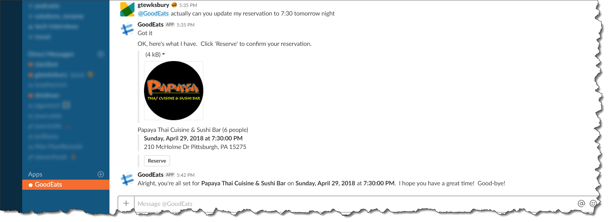

# Microsoft NodeJS Bot Framework Hands On Labs

Hello everyone !!! This is series of hands-on-labs as end-to-end guide to building conversational experience using the Microsoft NodeJS Bot framework. 

First of all, my since thanks and credits goes to Geoff Tewskbury's for the detailed hands on labs. If you want to checkout .NET Bot framework Hands on lab of the same demo, please refer [Geoff Tewskbury's github repository](https://github.com/gtewksbury/Microsoft-Bot-Framework-HOL). Most of the common steps/images are shared between two repositories.

> The content is broken up into 8 separate labs.  Each lab builds upon the previous, so it's highly recommended to walk through them in order.  That being said, if you're impatient I've added *starter* projects for each section.  

[Lab 1 - Setup](lab1-setup) walks through the setup of your Visual Studio Code development environment as well as the installation of the Microsoft Bot Emulator (priceless when it comes to debugging your application).

[Lab 2 - LUIS](lab2-luis) provides a hands-on walk through of training a custom LUIS model to understand and interpret user intents.  An absolute must for building conversational experiences.

[Lab 3 - Integrate LUIS](lab3-integrate-luis) demonstrates how to integrate the NodeJS Bot Framework with our LUIS model in addition to some basic conversational state management.

[Lab 4 - Bot Builder](lab4-bot-builder) provides a conceptual overview of the NodeJS Bot Framework and some of the critical components you'll want to become familiar with.

[Lab 5 - Dialogs](lab5-dialogs) Introduces and implements some general **Dialog** design patterns 

[Lab 6 - LUIS all the way down](lab6-luis-alltheway-down) implements design patterns for integrating our LUIS model throughout the entire life cycle of a conversation.

[Lab 7 - Custom Recognizers/Scorables](custom-recognizer) demonstrates global message handlers for 
addressing common commands throughout your bot application.

[Lab 8 - Azure Bot Service](azure-bot-service) walks through the process of deploying and hosting your bot logic within a reliable and durable Azure environment.

## Credits

- [Geoff Tewksbury](https://github.com/gtewksbury)

## Reference

- [Microsoft .NET Bot Framework Hands On Labs](https://github.com/gtewksbury/Microsoft-Bot-Framework-HOL)