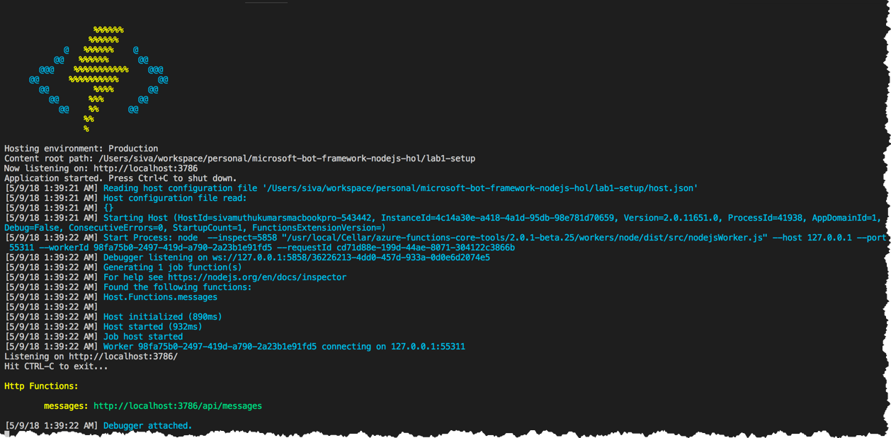
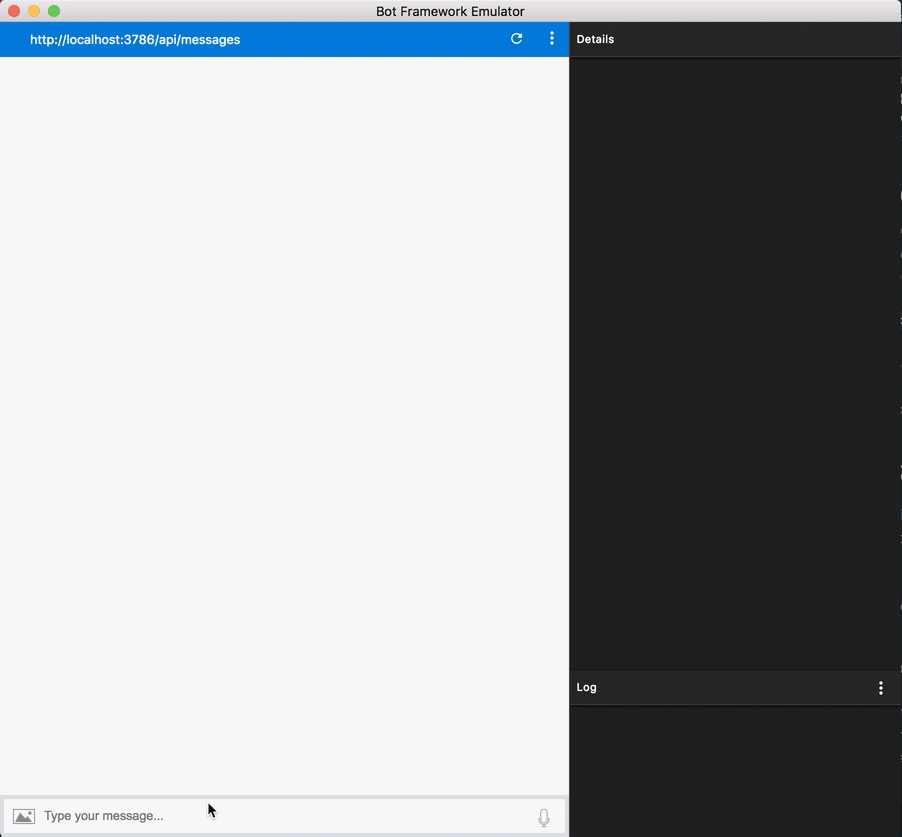

# Lab 1 - Bot Framework Setup

In this lab, we'll setup VSCode NodeJS Bot Framework development environment.

* Azure Function Core Tools
*	Creating and running our first *Hello World* bot project
* Running and debugging through VSCode and Bot Emulator
* A quick review of the Bot Builder SDK for NodeJS

## Prerequisites

Please install the following prerequisites.

* [NodeJS 8](https://nodejs.org)
* [VSCode](https://code.visualstudio.com) - IDE. VSCode can do anything. :-)
* [Azure Functions for Visual Studio Code](https://github.com/Microsoft/vscode-azurefunctions) - VSCode [extension](https://marketplace.visualstudio.com/items?itemName=ms-azuretools.vscode-azurefunctions) to run the Azure functions host locally and lot of other cool features
* [Azure Functions Pack](https://github.com/Azure/azure-functions-pack) - Package azure functions for optimization.
* [Bot Emulator](https://emulator.botframework.com) - Emulator to test the bot.

To install NodeJS(8.x) - At this time, NodeJS 10 is not supported by Azure Functions
```sh
brew install node@8
```

To install Azure Functions for Visual Studio, run the below command.
```bash
brew tap azure/functions
brew install azure-functions-core-tools
```

To install Azure functions pack, run the below command
```
npm install -g azure-functions-pack
```

## Getting Started


1. Open Command Pallete in VSCode (Cmd + Shift + P) and search for "Azure
Functions - Create Function project"

2. Select "Javascript" as Runtime

3. Create "HttpTrigger" and name it as messages

### Install Dependencies

* Install `botbuilder`, `botbuilder-azure` and `dotenv` dependencies.
 ```sh
 npm i botbuilder --save
 npm i botbuilder-azure --save
 npm i dotenv --save
 ```

* Copy the below snippet to setup hello world project

```javascript
"use strict";

require('dotenv').config();
var builder = require("botbuilder");
var botbuilder_azure = require("botbuilder-azure");
var path = require('path');

// For local development, appId, appPassword should be null
var connector = new botbuilder_azure.BotServiceConnector({
    appId: process.env['MicrosoftAppId'],
    appPassword: process.env['MicrosoftAppPassword'],
    openIdMetadata: process.env['BotOpenIdMetadata']
});

var bot = new builder.UniversalBot(connector, function (session, args) {
});

// Set inMemory Storage
var inMemoryStorage = new builder.MemoryBotStorage();
bot.set('storage', inMemoryStorage);
bot.localePath(path.join(__dirname, './locale'));

// Greetings Dialog
bot.dialog('GreetingsDialog', [
    function (session, results) {
        var text = session.message.text;
        // Count the text length and send it back
        session.endDialog(`You sent \"${text}\" which was ${text.length} characters`);
    }
]);

module.exports = connector.listen();
```

## Start and test your bot

In visual studio code, go to debug window and launch "Attach to Javascript functions" configuration.



> Add --port parameter in .vscode/tasks.json commands property. The default port will be in use, if you use this environment for Xamarin development;
```json
"command": "func host start --port 3786",
```

### Start the emulator and connect your bot
After you start your bot, connect to your bot in the emulator:

1. Type `http://localhost:3978/api/messages` into the address bar. (This is the default endpoint that your bot listens to when hosted locally.)
2. Click **Connect**. You won't need to specify **Microsoft App ID** and **Microsoft App Password**. You can leave these fields blank for now. You'll get this information later when you register your bot.

### Try out your bot

Now that your bot is running locally and is connected to the emulator, try out your bot by typing a few messages in the emulator.
You should see that the bot responds to each message you send by echoing back

`You sent <message> which was <message length> characters`

For eg: If you send `hello`, you might see `You sent hello which was 5 characters`



You've successfully created your first bot using the Bot Builder SDK for Node.js!

## Quick Recap

Congratulations, you now have a complete VSCode development environment capable of debugging custom bot applications!

Throughout the remainder of the labs, we'll be building out a bot that helps users make restaurant reservations.  Users will be able to ask our bot things like:

*	Make me a reservation at a good Indian restaurant in Pittsburgh
*	Can you book me a table tomorrow night at 7:30 for Mexican?

But wait a minute, we're simply sending text-based messages to our bot.  How can we possibly parse and interpret all the variations of how users might ask for a reservation?  Thats where Natural Language processing and Machine Learning comes in.

## Next Steps
In [Lab 2](../lab2-luis) we'll build a machine learning model using Microsoft's Language Understanding Intelligence Service (known as LUIS) to give our bot some smarts.
