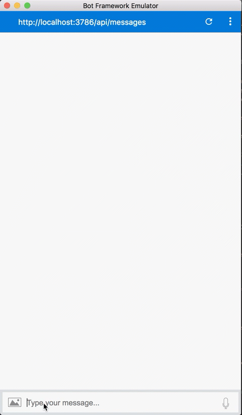

# Integrate LUIS

In this lab, we are going to integrate the sample bot created in [Lab 1 - Setup](../lab1-setup) with the LUIS model trained in [Lab2 - LUIS](../lab2-luis).

## Prerequisites

Get the LUIS Model ID and subscription key from [LUIS website](https://luis.ai).

```
https://westus.api.cognitive.microsoft.com/luis/v2.0/apps/<MODEL_ID>?subscription-key=<SUBSCRIPTION_KEY> &verbose=true&timezoneOffset=0&q=
```

## How to integrate LUIS?

``` javascript

// Add LUIS
var luisAppId = process.env.LuisAppId;
var luisAPIKey = process.env.LuisAPIKey;
var luisAPIHostName = process.env.LuisAPIHostName || 'westus.api.cognitive.microsoft.com';

const LuisModelUrl = 'https://' + luisAPIHostName + '/luis/v2.0/apps/' + luisAppId + '?subscription-key=' + luisAPIKey;

// Create a recognizer that gets intents from LUIS, and add it to the bot
var recognizer = new builder.LuisRecognizer(LuisModelUrl);
bot.recognizer(recognizer);

```

## Add Intent to handle LUIS recognition result

Create a dialog with triggerAction that matches the LUIS intent

```javascript

bot.dialog('CreateReservationDialog',
    ...
).triggerAction({
    matches: 'Create Reservation'
});

```

## Retrieve entity from the intent result

```js
bot.dialog('CreateReservationDialog',
    [(session, args, next) => {
        var intent = args.intent;
        var locationKey = 'RestaurantReservation.Address';
        var cuisineKey = 'RestaurantReservation.Cuisine';
        var whenKey = 'builtin.datetimeV2.datetime';
        var partySizeKey = 'builtin.number';

        var location = builder.EntityRecognizer.findEntity(intent.entities, locationKey);
        var cuisine = builder.EntityRecognizer.findEntity(intent.entities, cuisineKey);
        var when = builder.EntityRecognizer.findEntity(intent.entities, whenKey);
        var partySize = builder.EntityRecognizer.findEntity(intent.entities, partySizeKey);

        // Save it in the private conversation data.
        session.privateConversationData.reservation = {
            location: location ? location.entity : null,
            cuisine: cuisine ? cuisine.entity : null,
            when: when ? when.entity : null,
            partySize: partySize ? partySize.entity : null
        };

        next();
    },
    (session, results, next) => {
        var reservation = session.privateConversationData.reservation;
        if (reservation != null) {
            if (reservation.location) {
                session.send(`Location Preference: ${reservation.location}`);
            }

            if (reservation.cuisine) {
                session.send(`Cuisine Preference: ${reservation.cuisine}`);
            }

            if (reservation.when) {
                session.send(`Date Preference: ${reservation.when}`);
            }

            if (reservation.partySize) {
                session.send(`Party Size Preference: ${reservation.partySize}`);
            }
        }
        next();
    }]
).triggerAction({
    matches: 'Create Reservation'
});

```

## Demo


## Quick Recap

In this lab, we successfully connected our bot to our LUIS application, and configured our Create Reservation triggerAction. We also learned how to retrieve value from entities. Finally, we learned how to persist and retrieve state for our bot application.

## Next Steps

At this point in the labs we were able to configure our RootDialog to handle multiple user intents, but we're yet to do anything useful with the provided information. In subsequent labs, we'll create a more sophisticated conversational flow with multiple dialogs. However, before doing so I thought it would be a good idea to become familiar with some basic NodeJS Bot Builder concepts. In [Lab 4](../lab4-bot-builder) we'll focus on learning these concepts before moving back to enhance our bot!
